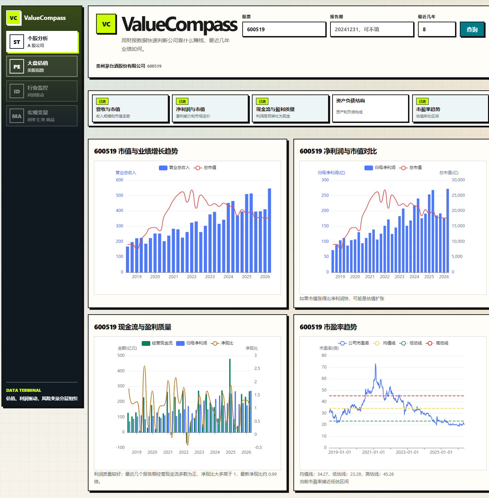
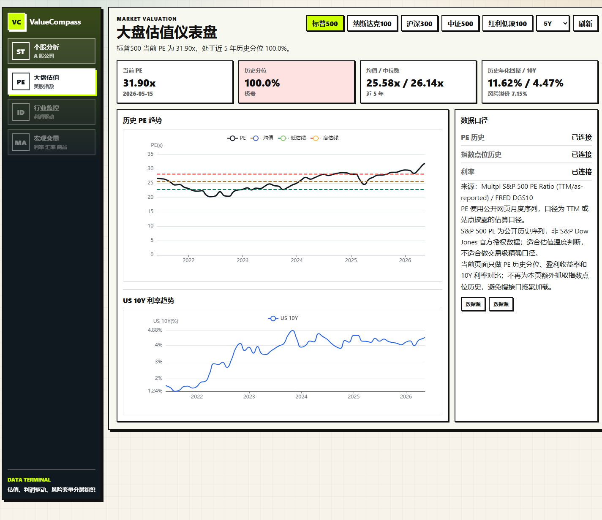

<h1 align="center">ValueCompass</h1>

<p align="center">
  Turn A-share financial statements into clear, interactive research signals.
</p>

<p align="center">
  
  
  
  
  
</p>

<p align="center">
  <a href="#why-valuecompass">Why</a> /
  <a href="#screenshots">Screenshots</a> /
  <a href="#features">Features</a> /
  <a href="#quick-start">Quick Start</a> /
  <a href="#api">API</a> /
  <a href="https://valuecompass.onrender.com/">Live Demo</a> /
  <a href="./README.zh-CN.md">简体中文</a>
</p>

ValueCompass is an open-source visual research dashboard for China A-share companies. It helps investors and builders quickly judge company quality, valuation, and profit drivers from public financial data.

At its core, ValueCompass helps answer one question faster:

> Is this company really making high-quality money?

The app combines public financial data, valuation charts, business breakdowns, cash-flow quality checks, peer-company context, and optional AI summaries in one research surface.

Live demo: [valuecompass.onrender.com](https://valuecompass.onrender.com/)

## Why ValueCompass

Financial statements are rich, but slow to scan. ValueCompass turns common research questions into focused visual blocks:

- How fast are revenue and profit growing, and how does the market value them?
- Is net profit backed by operating cash flow?
- What does the balance sheet look like, and where are the risk items?
- Which products, regions, or business lines drive revenue?
- Is the current valuation high or low versus its own history and broad-market context?

## Screenshots

### Company Analysis

Revenue, profit, cash-flow quality, and valuation history are shown together so the first read of a company is faster.



### Market Valuation

Major index PE levels are compared with historical ranges and 10Y yields to give the company view more market context.



## Features

| Area | Status | Description |
| --- | --- | --- |
| Revenue & market cap | Available | Compare operating scale with market valuation trends. |
| Net profit & market cap | Available | View earnings growth beside market value changes. |
| Cash-flow quality | Available | Compare operating cash flow, net profit, and cash-to-profit ratio. |
| Balance sheet structure | Available | Visualize assets, liabilities, cash, receivables, inventory, and debt. |
| Business breakdown | Available | Break down revenue by product, industry, region, and channel. |
| Peer companies | Available | Recommend comparable companies from business keywords. |
| Profit driver model | Experimental | Connect business segments with commodity, price, or volume drivers. |
| Market valuation | Available | Compare major index PE levels with historical ranges and 10Y yields. |
| AI analysis | Optional | Generate structured financial summaries with an OpenAI-compatible API. |

## Tech Stack

- Frontend: Next.js 15, React 19, ECharts
- Backend: FastAPI, AKShare, pandas
- AI: OpenAI-compatible API
- Deployment: single FastAPI entry point serving the built frontend and `/api/*`

## Quick Start

Recommended runtime:

- Python 3.12+
- Node.js 20+

### 1. Backend

```bash
cd backend
python -m pip install -r requirements.txt
python app.py
```

Backend runs at:

```text
http://127.0.0.1:5001
```

### 2. Frontend

```bash
cd frontend
npm install
npm run dev
```

Frontend runs at:

```text
http://127.0.0.1:3000
```

During local development, the frontend calls the backend API at `http://127.0.0.1:5001`.

### 3. Single-Server Mode

Build the frontend first, then start the backend. FastAPI will serve both the static frontend files and `/api/*`.

```bash
cd frontend
npm install
npm run build

cd ../backend
python -m pip install -r requirements.txt
python app.py
```

Open:

```text
http://127.0.0.1:5001
```

## Environment

Copy `backend/.env.example` to `backend/.env` and configure your OpenAI-compatible API settings:

```text
OPENAI_BASE_URL=https://api.openai.com/v1
OPENAI_API_KEY=your_api_key
OPENAI_MODEL=your_model
OPENAI_TEMPERATURE=0.1
```

AI analysis is optional. You can use OpenAI or any OpenAI-compatible endpoint. The financial charts and valuation dashboards can run without an API key.

## API

Common endpoints:

```text
GET  /api/health
GET  /api/dashboard-data?stock=600519&years=8
GET  /api/revenue-market-cap?stock=600519&years=8
GET  /api/profit-market-cap?stock=600519&years=8
GET  /api/cash-flow-quality?stock=600519&years=8
GET  /api/balance?stock=600519
GET  /api/revenue-structure?stock=600519&years=8
GET  /api/peer-companies?stock=600519&limit=6
GET  /api/pe-trend?stock=600519&years=8
GET  /api/market-index-valuation?index=sp500&years=5
POST /api/ai-analysis
POST /api/business-type-analysis
```

Full interactive API docs are available at:

```text
http://127.0.0.1:5001/docs
```

## Project Structure

```text
backend/              FastAPI backend, data processing, API cache
frontend/             Next.js frontend and ECharts dashboard
docs/                 Roadmap, notes, and README screenshots
docs/screenshots/     Product screenshots used by this README
render.yaml           Render deployment configuration
```

## Notes

- Data comes from public sources and may be delayed, incomplete, or inconsistent across providers.
- `backend/cache/` is generated locally to speed up repeated analysis and is ignored by Git.
- This is a learning and research project, not a trading system.

## Roadmap

- Add more industry-specific analysis templates.
- Expand profit driver models for commodity, manufacturing, and consumer businesses.
- Support exporting research snapshots.
- Improve data-source fallback and freshness checks.
- Add an English UI mode.

## Disclaimer

ValueCompass is for learning, research, and data visualization only. It is not investment advice. Please verify financial data independently before making any investment decision.
